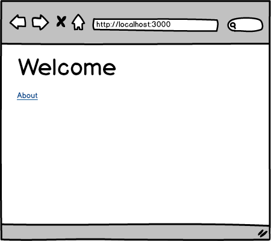
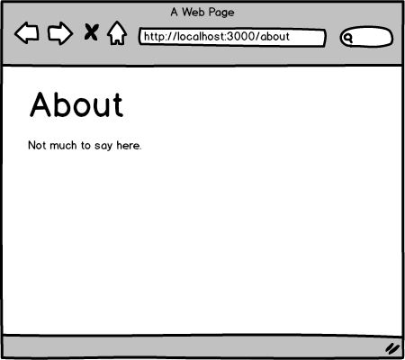
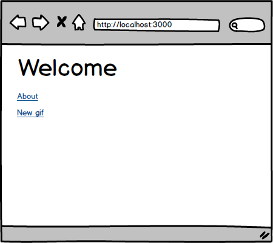
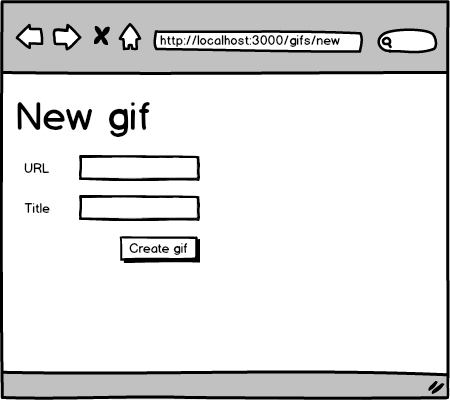
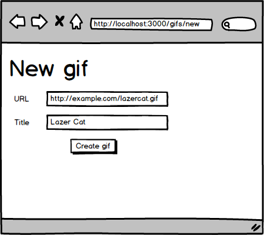
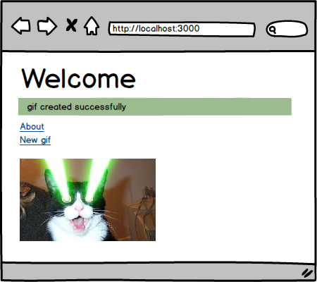
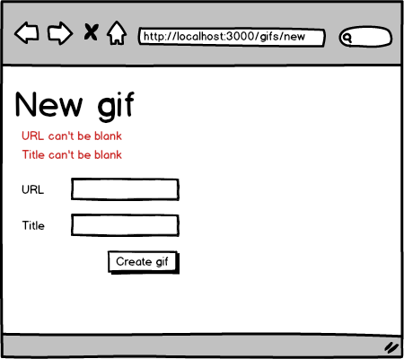
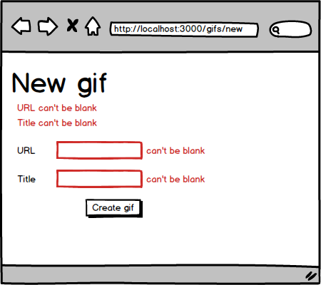

# g3 Assessment Week 10

This assessment is about looking at gifs! Sort of.

Your app will allow users to add to their favorite gifs along with a title. The requirements
for the assessment are below.

Don't forget to write tests!

## Stories
**Anonymous user can view about page**

```
As an anonymous user
When I'm on the home page
And I click on "About"
Then I see the about page
```




**Anonymous user can create a gif**

```
As an anonymous user
When I'm on the home page
And I click on "New gif"
And I fill in a URL and a Description
And I click "Create gif"
Then I should see the gif image and description on the home page
And I should see "Gif created successfully"
```






**Anonymous user cannot create a gif without a url or a title**

```
As an anonymous user
When I'm on the home page
And I click on "New gif"
And I click "Create gif"
The I should see the errors messages shown in the mockup
```



**Anonymous user sees better error messages when a gif can't be saved**

```
As an anonymous user
When I'm on the home page
And I click on "New gif"
And I click "Create gif"
The I should see the errors messages above the form fields as shown in the mockup
And I should see the error messages next to the fields

```


